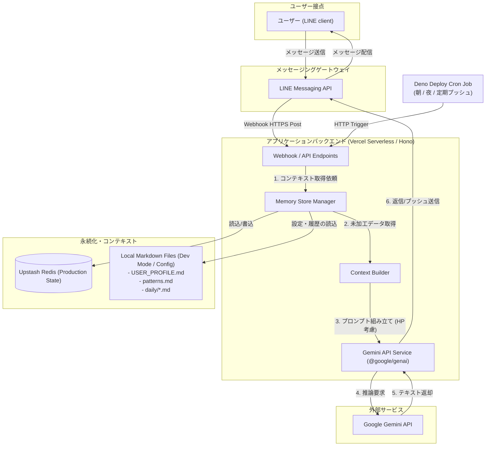

# LLM-Powered State-Adaptive Companion Bot (LINE Bot)

LINE Messaging API と Google Gemini API を統合し、ユーザーのエネルギー状態（HP）やパーソナリティに適応して伴走する、ステートフルな LINE 伴走システムです。

単なる「タスク管理」ではなく、「ユーザーのコンテキストに寄り添う生活の支援」を目的とし、Markdown ベースのナレッジモデルとサーバーレス構成を組み合わせて実装されています。

---

## 🎯 プロジェクトの狙いとアピールポイント

技術的なアピールポイントとして、以下の設計・実装に注力しています。

1. **State-Adaptive（状態適応型）プロンプティング**
   - ユーザーの会話や自己申告から「HP（1〜5）」を自動抽出して状態を管理。
   - HP低下時には自動的にトーンを和らげ、タスクの合格ラインを引き下げるなど、LLM の出力振る舞いを動的に調整するコンテキスト構築ロジックを実装。
2. **サーバーレス（Vercel）におけるステートフル制御**
   - Ephemeral な Vercel Serverless Functions の制約を克服するため、**Upstash Redis** を用いたキャッシュ・セッションストレージ設計を採用。
   - ローカル開発時はファイルシステム（Markdown 履歴）を使い、本番環境では Redis を優先する透過的なストレージ抽象化レイヤーを構築しています。
3. **MarkdownベースのローカルRAG / Context Builder**
   - `USER_PROFILE.md` や `patterns.md` に定義されたユーザー情報・行動ルールを解析し、直近3日間の行動ログとマージして Gemini に与える文脈を最適化する Context Builder サービスを設計。
4. **Vercel Cron によるリアクティブ＆プロアクティブなプッシュ配信**
   - Webhook による応答（受動的）だけでなく、定時・定期の行動チェックや振り返り（能動的）を Vercel Cron を用いてスケジューリング。

---

## 📐 システムアーキテクチャ



---

## 🛠️ 技術スタック

* **Runtime**: Deno v2+ / TypeScript
* **Web Framework**: Hono
  * 軽量かつエッジ/サーバーレス環境で高速動作し、型安全なルーティングを実現。
* **Serverless Platform**: Vercel
  * Serverless Functions + Vercel Cron を活用したイベント駆動型実行モデル。
* **Database / Cache**: Upstash Redis (Serverless Redis)
  * コネクションプールを必要としない REST API 経由の接続（HTTP-based Redis client）により、サーバーレス環境でのコールドスタート耐性を向上。
* **LLM Engine**: Google Gemini API (`gemini-3.1-flash-lite`) via `@google/genai`
* **SDK / API Integration**: `@line/bot-sdk`

---

## 📂 主要なコード構成

```text
├── api/                  # Vercel Serverless 用のエントリーポイント
├── src/
│   ├── index.ts          # Hono アプリの初期化とルーティング定義
│   ├── routes/           # Webhook および Cron トリガーのルートハンドラー
│   └── services/
│       ├── contextBuilder.ts # プロンプトテンプレートへのコンテキスト合成
│       ├── llm.ts            # Gemini API クライアントと推論処理
│       └── memoryStore.ts    # Redis とローカルファイルを抽象化した永続化ロジック
├── memory/               # ローカル保存用 Markdown データベース
│   ├── USER_PROFILE.md   # ユーザープロフィール・ペルソナ
│   ├── patterns.md       # HP別のコーチング基準・行動ポリシー
│   └── daily/            # 日々の生ログやタスク進捗ファイル
└── vercel.json           # Vercel Cron およびルーティング構成ファイル
```

---

## 🚀 開発環境のセットアップ

本リポジトリは TypeScript と Bun を用いて管理されています。

### 1. リポジトリの準備
```bash
git clone <repository-url>
cd line-companion-bot
bun install
```

### 2. 環境変数の設定
`.env.example` を参考に、プロジェクトルートに `.env` もしくは `.env.local` を作成し、各クレデンシャルを記述します。

```env
# Server Config
PORT=3000

# LINE Credentials
LINE_CHANNEL_ACCESS_TOKEN=your_token
LINE_CHANNEL_SECRET=your_secret
LINE_USER_ID=your_user_id

# Google Gemini API
GEMINI_API_KEY=your_gemini_key

# Upstash Redis (Vercel環境での状態永続化用)
UPSTASH_REDIS_REST_URL=your_redis_url
UPSTASH_REDIS_REST_TOKEN=your_redis_token
```

### 3. ローカル実行
```bash
pnpm dev
```
ローカルサーバーが起動します。外部からの Webhook 受信を確認するには `ngrok` や `localtunnel` を介してローカルポート（デフォルト: 3000）を公開してください。

### 4. Vercel へのデプロイ
Vercel CLI を使用して本番デプロイを行います。
```bash
npx vercel --prod
```
環境変数 `LINE_CHANNEL_ACCESS_TOKEN`, `LINE_CHANNEL_SECRET`, `LINE_USER_ID`, `GEMINI_API_KEY`, `UPSTASH_REDIS_REST_URL`, `UPSTASH_REDIS_REST_TOKEN` を Vercel のプロジェクト設定で設定します。

---

## 📄 ライセンス

MIT License
