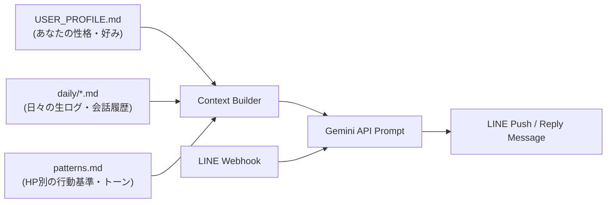

# LINE Companion Bot 🤖🌱

> **「タスク管理」ではなく「あなたの文脈に寄り添う生活の伴走者」を。**  
> **Markdown とプロンプトを書き換えるだけで、自分好みの AI 伴走者を作れる LINE Bot テンプレートです。**

---

## 🌟 特徴・魅力

1. **誰でも無料で即作成**
   - LINE Messaging API (無料) と Google Gemini API (無料枠/激安) のキーを用意し、Vercel にデプロイするだけで自分だけの LINE Bot が完成します。
2. **Markdown 編集だけで「人格・口調・価値観」を自由自在にカスタマイズ**
   - `memory/USER_PROFILE.md` や `memory/patterns.md` を書き換えるだけで、**関西弁の気安い友達**、**穏やかなカウンセラー**、**スパルタコーチ**など、どんな人格・トーンにも変えられます。
3. **合格ラインを下げてくれる優しさ**
   - 世の中のツールのような「もっと頑張れ」ではなく、「今日は水飲んでPC開けたら100点」と最低勝利条件を提案し、挫折を防ぎます。

---

## 📐 アーキテクチャ



---

## 🎭 カスタマイズ例（Markdownを書き換えるだけ！）

### パターンA: 関西弁の気安い伴走者（デフォルト）
> 「おはよう。今日は大きく勝たんでいい日っぽい。まず水飲んで、10分だけ机に向かえたらそれで100点やで。」

### パターンB: 褒めて伸ばす穏やかなカウンセラー
> 「おはようございます。今日は少しお疲れ気味ですね。まずは深呼吸をして、好きな温かい飲み物を淹れられたらそれだけで満点ですよ。」

### パターンC: ミニマリスト・静かな観察者
> 「無駄な目標は捨てよう。今日やるべきことは1つだけ。コードを1行読む。それ以上は明日考えればいい。」

---

## 🚀 5分でできる！自分用Botの作り方

### 必要なもの
- LINE Developer アカウント（[LINE Developers](https://developers.line.biz/) で無料作成）
- Google AI Studio API Key（[Google AI Studio](https://aistudio.google.com/) で無料取得）
- Vercel アカウント（[Vercel](https://vercel.com/) で無料作成）

### ステップ 1: リポジトリの Fork / クローン
```bash
git clone https://github.com/your-username/line-companion-bot.git
cd line-companion-bot
pnpm install
```

### ステップ 2: 自分用のプロフィールを書く
`memory/USER_PROFILE.sample.md` を参考に、`memory/USER_PROFILE.md` を作成して自分の性格や呼ばれ方、好みのトーンを書きます。

```markdown
# USER_PROFILE
name: あなたの名前
tone: 希望の口調（例: 優しい先輩、語尾に〜だにゃ、など）

## 性格・傾向
- 理想が高くパンクしやすい...
```

### ステップ 3: Vercel にデプロイ
```bash
npx vercel --prod
```
Vercel の設定画面で以下の環境変数をセットします：
- `LINE_CHANNEL_ACCESS_TOKEN`
- `LINE_CHANNEL_SECRET`
- `LINE_USER_ID`
- `GEMINI_API_KEY`

### ステップ 4: LINE Developers に Webhook URL を登録
LINE Webhook URL に `https://your-vercel-app.vercel.app/webhook` を設定し、有効化すれば完了です！

---

## ⏰ メッセージ送信時間のカスタマイズ (`vercel.json`)

デフォルトでは以下の時間（日本時間）に自動でLINEへメッセージが配信されます。

| 種類 | デフォルト送信時間 (JST) | `vercel.json` 内の Cron 式 (UTC) |
|---|---|---|
| **朝の100点条件** | **朝 08:00** | `0 23 * * *` (UTC 23:00 = JST 08:00) |
| **夜の振り返り** | **夜 21:30** | `30 12 * * *` (UTC 12:30 = JST 21:30) |

自分の生活リズムに合わせて時間を変えたい場合は、`vercel.json` の `schedule` （Cron式）を編集して再デプロイしてください。

```json # vercel.json のCron設定例
{
  "crons": [
    {
      "path": "/cron/morning",
      "schedule": "0 22 * * *"  // 朝7:00 (JST) にしたい場合 (UTC 22:00)
    },
    {
      "path": "/cron/evening",
      "schedule": "0 13 * * *"   // 夜22:00 (JST) にしたい場合 (UTC 13:00)
    }
  ]
}
```
> ※ Vercel Cron は **UTC（協定世界時）** で指定する必要があります（日本時間から 9 時間引いた時間を設定してください）。

---

## 🛠️ 技術スタック

- **Engine**: Node.js + Hono (TypeScript)
- **Deployment**: Vercel (Serverless Functions + Vercel Cron)
- **LLM**: Google Gemini API (`gemini-3.1-flash-lite`) via `@google/genai`
- **Messaging**: LINE Messaging API (`@line/bot-sdk`)

---

## 📄 ライセンス

MIT License - ご自由にフォーク・改造してお使いください！
